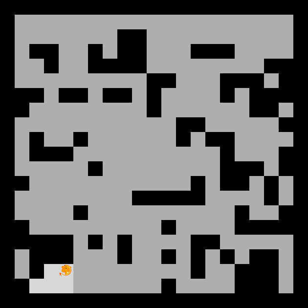
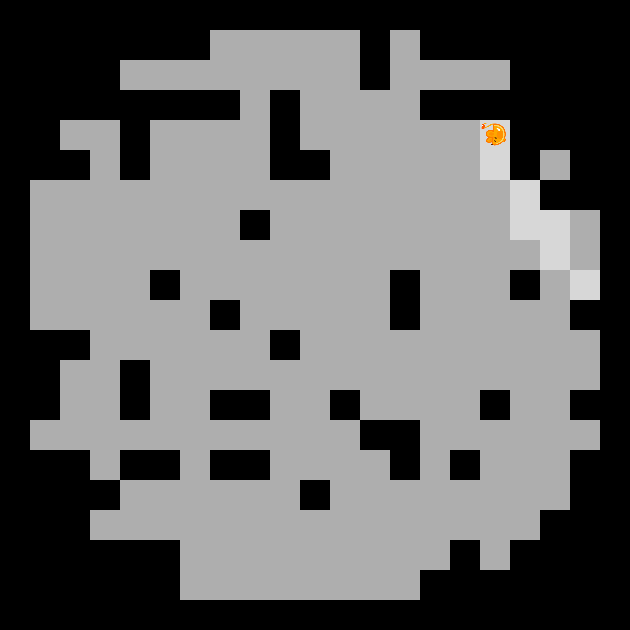
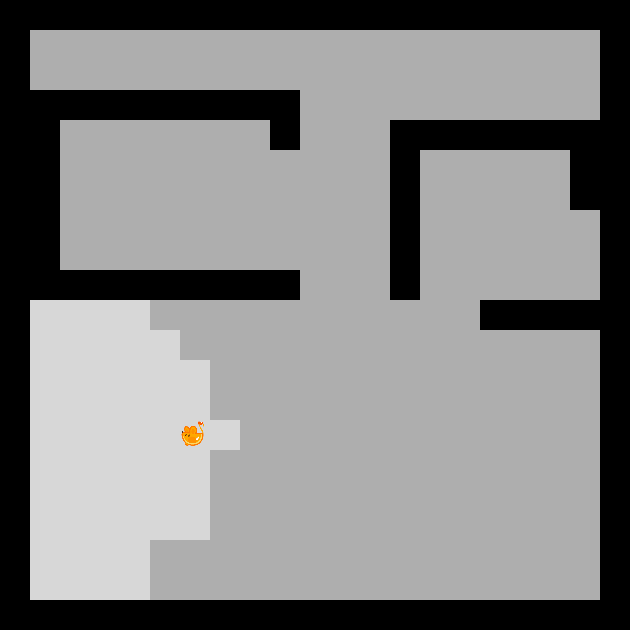
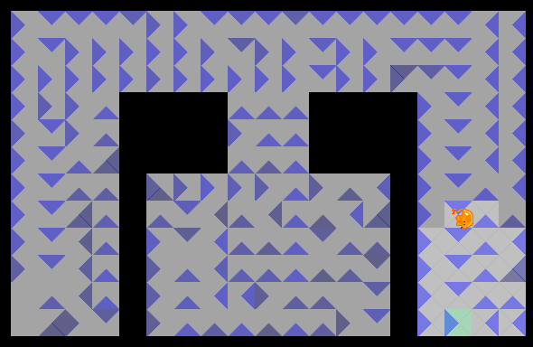
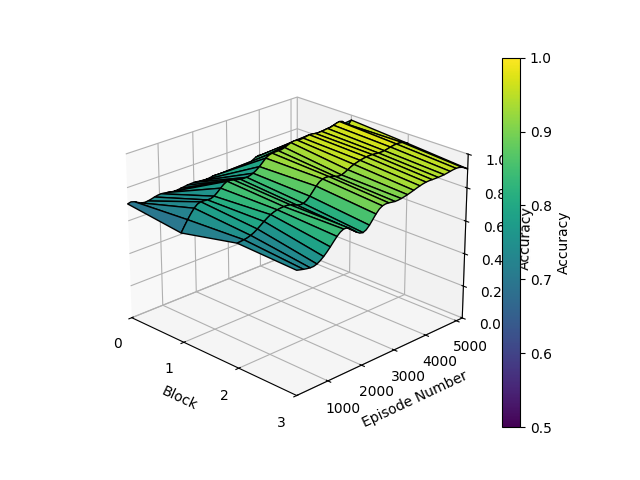
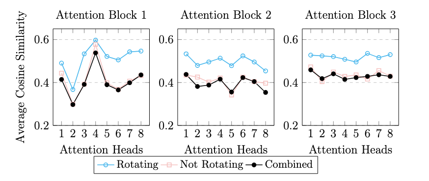

# Master thesis in Computer Science at NTNU 2025
By Gro Oleivsgard and Henrik Larsen

## Explainable AI Approaches to Detect Independent Spatial Representations of Environments in Deep Reinforcement Learning Agents

The purpose of our master thesis is to explore how methods from explainable artificial intelligence (XAI) can be applied to a transformer-based reinforcement learning agent to evaluate parallels in how spatial environments are encoded between an artificial neural network and the biological brain. This is an interesting area of research because it bridges the gap between artificial intelligence and neuroscience using novel methods from the field of XAI.

In our thesis, we will determine if spatial environments are independently encoded in a transformer-based reinforcement learning architecture. This is inspired by studies on the biological brain which suggests that spatial representations are stored independently with minimal overlap between different environments. To develop an artificial agent that can act in an environment similar to physical space, we seek to implement the architecture in a continuous, partially observable environment. The thesis will be guided by the following research questions.

*RQ1: What methods improve the training of transformer-based reinforcement learning agents using Proximal Policy Optimization (PPO) in partially observable continuous environments?*

*RQ2: How do we identify spatial mapping in an artificial neural network using methods from explainable artificial intelligence (XAI)?*

*RQ3: How different must an environment be for a cognitive remapping of the environment in an artificial neural network to occur?*

*RQ4: Can static concepts be used to detect cognitive remapping in transformer-based deep reinforcement learning agents?*

*RQ5: Given the identification of cognitive remapping, what are the scalability limits for transformer architectures in handling multiple environments?*

In the beginning, we will explore whether three distinct environments are represented differently within the network:

  

### Explainable AI methods

We are researching multiple XAI methods on their applicability to explain the encodings of navigation in deep neural networks. Below is a summary of the methods we tested this past fall, where we trained an agent to find a goal, comparing a regular feed-forward network to a transformer-based network based on the Deep Q-learning reinforcement learning algorithm.

1. **Visualization of Q-values in a Deep Q-learning network**\
   The Deep Q-learning algorithm is a reinforcement learning algorithm where the agent learns optimal actions by experiencing consequences in the form of immediate positive or        negative rewards and uses this to estimate the value of the next state. Each state has an action with a corresponding q-value. After training a regular feed-forward network, we    visualized the q-values in order to depict how the agent has learned to move through the environment. The plot shows a clear preference for moving toward the goal in areas that    are closer to the goal.
   
   

2. **Concept Activation Vectors**\
   Concepts are human-interpretable patterns in data that convey information at a high level, making it straightforward for humans to identify whether a concept is present or not,
   even if the raw data is complex and difficult to interpret. We tested for the presence of the following concepts:

   
   | Concept      | Description                                                                |
   |--------------|----------------------------------------------------------------------------|
   | next to wall | The agent is looking into a wall and tried to move forward.                |
   | rotating     | The agent has been stuck in the same position only moving left and right.  |
   | goal in sight| The agent has the goal in its FOV.                                         |

   Below is a graph of the transformer-based model's ability to detect the concept 'goal in sight'. From this graph, we can infer that the network is learning the importance of       the goal throughout the training over 5000 iterations.
   
   
 
3. **Gradient Self-Attention Mapping (Grad-SAM) for Transformers**\
   Grad-SAM highlights the most important tokens (observations) in a sequence that contribute to the model's predictions to gain insight into what the model values in a sequence      of observations. This is achieved by multiplying the attention weights at the multi-head self-attention module of each block with the values of the corresponding gradients of      the model with respect to the attention weights. We noticed that the agent regularly got stuck in certain places, and simply rotated in place until the episode ended. We           therefore wanted to perform Grad-SAM to compare this rotating behavior to other, non-rotating behavior. 

   We found that the cosine similarity values of the 'rotating' behavior were consistently higher compared to the 'non-rotating' behavior in all three blocks across all self-         attention heads. The findings indicate a similarity in Grad-SAM values for rotating observations, suggesting that the transformer architecture maintains a consistent response      pattern to repeated rotational behavior. However, we could not identify a similar pattern for 'not rotating', likely due to the high diversity in the observations. This            limitation highlights the need for further research to improve the classification of the initial observations used in Grad-SAM calculation.

   

   
